# Architecture

## Design

Each stage owns one resource group and a local Terraform state. Roots compose small modules; no stage reads another stage's state. This makes cleanup and failure isolation explicit.

```mermaid
flowchart LR
  S00[00 preflight] --> S01[01 minimal VNet]
  S01 --> S02[02 segmented tiers]
  S02 --> S03[03 routes and NSGs]
  S03 --> S04[04 two-way peering]
  S04 --> S05[05 hub and two spokes]
  S05 --> S06[06 Storage access]
  S06 --> S07[07 diagnostics]
  S07 --> S08[08 fault practice]
  S08 --> S09[09 verified cleanup]
  S09 --> S10[10 hybrid design]
```

The default data plane is private and has no egress. Every workload subnet sets `default_outbound_access_enabled = false`. Linux endpoints use platform images, cloud-init, the Azure VM agent, OpenSSH, Python's standard library, and a 23:00 UTC auto-shutdown schedule; they do not download packages. Auto-shutdown limits accidents but never replaces destroy. Run Command is a control-plane mechanism and is not evidence of general network reachability.

## Explicit outbound choices

1. **Default:** none; sufficient for east-west tests.
2. **Temporary public IP:** not implemented; adds exposure and cost.
3. **NAT Gateway:** predictable egress but fixed hourly/data cost; design-only.
4. **Azure Firewall/NVA:** centralized policy and forwarding, but paid/operationally complex; design-only.

Hub/spoke peerings are not transitive. Spoke-to-spoke forwarding requires a correctly configured forwarding appliance, UDRs, and peering flags, none of which the default stage claims to provide.

## Stage roots

Stages 01–08 are standalone Terraform roots. Stages 00, 09, and 10 are script/document driven. Resources in two stages may use the same teaching CIDR because stages are independent and should not coexist unless documented.
