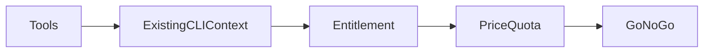

# Stage 00 — Prerequisites and cost preflight

**Outcome:** Record a go/no-go account mode, region, SKU, quota, current prices, and cumulative budget without changing Azure.
**Difficulty:** Introductory

## Objectives and prerequisites

Understand local state, Azure authentication choices, spending controls, and why advertised free services are not entitlements. Install nothing during the lab: use PowerShell 7, Git, Terraform `>=1.7,<2`, Azure CLI, and optional Bash already approved on the workstation.



## Read-only checks

```powershell
./scripts/powershell/Test-Tools.ps1
az account show --query "{name:name,state:state}" # omits IDs from recorded evidence
./scripts/powershell/Get-CostPreflight.ps1 -Location westeurope
```

```bash
./scripts/bash/test-tools.sh
./scripts/bash/cost-preflight.sh westeurope Standard_B1s
```

Do not run `az login` from automation, register providers, remove a spending limit, or alter billing. Record provider state only; deployment fails closed if registration is unavailable. Confirm offer/category, spending limit, promotional credit/remaining credit where exposed, free-service eligibility and remaining use, budget availability, B-series restrictions, regional vCPU and public-IP quota, image terms, Bastion Developer availability, and retail prices for compute, disks, Storage, transactions, private endpoints, peering/data, logs, and retained data.

Classify the account as `active-credit`, `free-services`, `no-credit`, or `payg` using [cost management](../../docs/cost-management.md). Run:

```powershell
./scripts/powershell/Test-CostGate.ps1 -Stage 01 -AccountMode no-credit -StageEstimateUsd 0 -CumulativeEstimateUsd 0
```

The expected result in `no-credit` mode is a blocked live gate. That is positive safety evidence.

## State and authentication

Local state is default and may contain sensitive values. `.gitignore` excludes it. Optional team state is a manual integration described in [remote state](../../docs/remote-state.md). Local interactive CLI auth and GitHub OIDC are separate; no client secret is used.

## Knowledge check

1. Why can a zero-hourly-price VNet lab still bill?
2. Do budgets or expiration tags stop resources? (No.)
3. What happens when a price or entitlement is unknown? (Block live deployment.)

## Cleanup and completion

No resource was created. Completion is binary when tool versions satisfy constraints, account mode is recorded, all live-stage gates have explicit pass/fail evidence, and no sensitive identifier was saved in Git.
