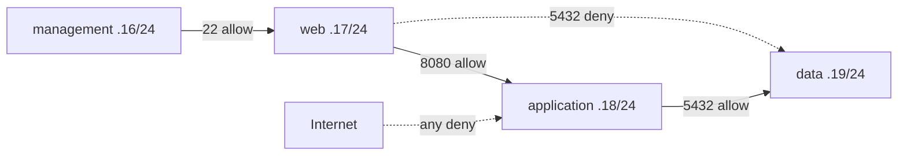

# Stage 02 — Three-tier segmentation

**Outcome:** Prove all five rows of a deny-by-default four-tier communication matrix with exactly four short-lived private VMs.
**Difficulty:** Intermediate

## Objectives and prerequisites

Reason about subnet NSGs, priorities, stateful return traffic, listener evidence, and source identity. Stage 00 must confirm price, four eligible VM allocations, regional vCPU quota, and both stage/cumulative envelopes. If not, plan and test statically; label live evidence **planned, not executed**.



The VNet is exactly `10.20.16.0/20`. All four workload subnets have default outbound disabled. Management and web rely on preinstalled SSH; cloud-init starts Python standard-library listeners on application:8080 and data:5432 without package downloads.

## Resources and cost

Default: resource group, VNet, four subnets, four NSGs. Live: exactly four Linux VMs, NICs, and Standard LRS disks; zero public IPs. Discover current [VM](https://azure.microsoft.com/pricing/details/virtual-machines/linux/) and [disk](https://azure.microsoft.com/pricing/details/managed-disks/) prices. The stage is unavailable live if four endpoints exceed verified free allocation, quota, USD 2 equivalent, or cumulative USD 10 equivalent.

## Deploy

```powershell
./scripts/powershell/Invoke-TerraformStage.ps1 -Stage 02 -Action test
./scripts/powershell/Invoke-TerraformStage.ps1 -Stage 02 -Action plan
# Only after gate; pass variables securely, then:
./scripts/powershell/Invoke-TerraformStage.ps1 -Stage 02 -Action apply -CostGateApproved
```

```bash
./scripts/bash/terraform-stage.sh 02 test
COST_GATE_APPROVED=true ./scripts/bash/terraform-stage.sh 02 apply
./scripts/bash/test-stage02-connectivity.sh
```

Expected safe plan: `virtual_machines = 0`. Approved live plan: exactly four.

## Acceptance evidence

Run `./scripts/powershell/Test-Stage02Connectivity.ps1`. It uses Run Command only to execute tests **from each named source VM**:

| Flow | Expected evidence |
|---|---|
| management → web TCP 22 | fresh socket prints `CONNECT_OK` |
| web → application TCP 8080 | `CONNECT_OK`; application listener known |
| application → data TCP 5432 | `CONNECT_OK`, independently proving data listener |
| web → data TCP 5432 | `CONNECT_DENIED` after `ss -lnt` and prior allowed test prove listener |
| internet → application any | zero public IPs plus explicit `deny-internet-any`; no reachable ingress path |

NSGs are stateful. Test fresh connections after rule changes; an established return flow is not proof of a broad reverse rule.

## Troubleshoot and knowledge check

Check cloud-init completion and `ss -lnt`, source/destination private IP, effective NSGs, then IP flow verification. Why is a timeout without listener proof ambiguous? Why can Run Command reach a private VM without proving data-plane internet access?

## Cleanup and completion

Destroy immediately, then run the residual check. Completion requires all five expected results, exactly four live VMs during testing, no public IP, and zero chargeable residuals.
