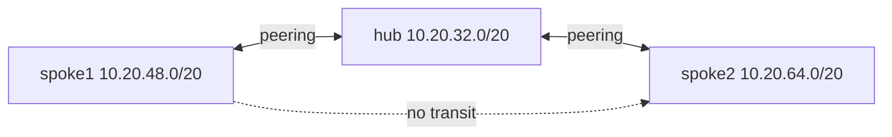

# Stage 05 — Hub and spoke

**Outcome:** Build a hub and two spokes while proving that peering alone does not provide spoke-to-spoke transit.
**Difficulty:** Intermediate

## Objectives and prerequisites

Compare centralized and distributed NSGs, shared Private DNS, forwarded traffic flags, and routed-hub requirements without deploying Azure Firewall, NVA, or gateway.



## Resources and cost

Default: RG, three VNets/subnets, NSG, and four directional peering objects. Three short-lived private endpoints and the shared Private DNS zone/links are optional. No firewall, gateway, public IP, or analytics is used. Peered bytes can bill; verify [VNet](https://azure.microsoft.com/pricing/details/virtual-network/) and [Private DNS](https://azure.microsoft.com/pricing/details/dns/) pricing.

## Deploy and verify

```powershell
./scripts/powershell/Invoke-TerraformStage.ps1 -Stage 05 -Action plan
az network vnet peering list --resource-group vnetlab-05-rg --vnet-name vnetlab-05-hub-vnet -o table
```

```bash
./scripts/bash/terraform-stage.sh 05 plan
```

Expected exact spaces are hub `.32/20`, spoke1 `.48/20`, and spoke2 `.64/20`; output says transit false. Positive: each hub/spoke peering is Connected. In an approved live run, fresh TCP 8080 connections from each spoke to the hub succeed. Negative: spoke1 to spoke2 fails because no direct peering or forwarding route exists. Listener health on spoke2 must be proved from Run Command before that denial is interpreted. After a separate approved `enable_private_dns=true` plan, all three DNS links exist.

A routed design would require a forwarding appliance/firewall, IP forwarding, `allow_forwarded_traffic`, UDRs in both directions, return-path symmetry, and cost approval. Gateway transit is a separate VPN/ExpressRoute feature.

## Troubleshoot and knowledge check

Inspect both directional peerings, links, and effective routes. Why does the hub seeing both prefixes not make it a router? What changes if centralized inspection is required?

## Cleanup and completion

Destroy and run the residual union check. Completion requires successful hub/spoke tests, failed spoke-to-spoke transit with route evidence, no paid transit resource, exact prefixes, and no chargeable residual.
