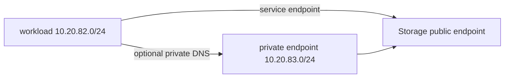

# Stage 06 — Service endpoint and private endpoint

**Outcome:** Restrict Azure Storage to a service-endpoint subnet, then optionally prove private DNS/connectivity before disabling public access.
**Difficulty:** Intermediate

## Objectives and prerequisites

Distinguish service endpoints (public service address plus subnet identity) from Private Link (private NIC/IP plus DNS). Complete current Storage, transaction, retained-data, private endpoint, DNS, one-VM, and disk price checks. Pick a globally unique non-sensitive Storage name.



## Resources and cost

Base network: RG, `10.20.82.0/23` VNet and two private subnets. Approved live phase: one managed-identity VM/NIC/disk, a `Storage Blob Data Reader` assignment, and Standard LRS Storage with subnet firewall. Optional phase: private endpoint, generated NIC, Private DNS zone/link. Public IPs are zero. See [Storage](https://azure.microsoft.com/pricing/details/storage/blobs/) and [Private Link](https://azure.microsoft.com/pricing/details/private-link/) pricing. Unknown cost blocks the phase.

## Two-phase deployment

**Phase 1 — service endpoint**

```powershell
./scripts/powershell/Invoke-TerraformStage.ps1 -Stage 06 -Action plan
# Approved values: enable_live=true, public_network_access_enabled=true,
# enable_private_endpoint=false, unique storage name, ephemeral SSH public key.
```

From the test VM via Run Command, `getent hosts <account>.blob.core.windows.net` should resolve publicly. A Python request must obtain an IMDS token for `https://storage.azure.com/` and list blob containers with HTTP 200. An outside context not on the allowed subnet must be rejected. Shared-key access and trusted-service bypass are disabled.

**Phase 2 — optional private endpoint**

1. Set `enable_private_endpoint=true`; keep `public_network_access_enabled=true`.
2. Apply, then run `Test-Stage06PrivateConnectivity.ps1` with the account name and private endpoint output. DNS and managed-identity data access must both pass.
3. Resolve the generated `.lab/stage06-private-connectivity.txt` to an absolute path.
4. Only then set `private_connectivity_verified=true`, provide `private_connectivity_evidence_file`, and set `public_network_access_enabled=false`.

The Terraform precondition rejects an earlier or single-phase disable. Bash uses `./scripts/bash/terraform-stage.sh 06 plan`; equivalent DNS, IMDS-token, and Storage HTTP evidence must be captured before phase two.

## Negative tests and troubleshooting

Outside DNS must not be treated as private proof. From an unlinked context, private name resolution/access must fail as designed. Investigate zone suffix, A record, zone group, VNet link, PE approval, subnet policy, and service firewall in that order.

Knowledge check: Does a service endpoint assign a private service IP? Why can disabling public access first lock out the test?

## Cleanup and completion

Destroy immediately after phase 2. Verify private endpoint NIC, DNS link/zone, Storage, test disk/NIC, and RG are gone. Completion requires phase-order evidence and `Test-ResidualResources.ps1` returning `CLEANUP_COMPLETE`.
