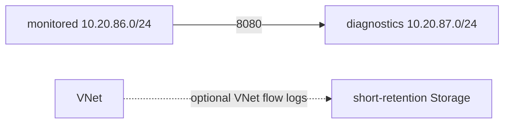

# Stage 07 — Network monitoring

**Outcome:** Gather route, NSG, connection, DNS, and optional VNet flow-log evidence without enabling persistent analytics.
**Difficulty:** Intermediate

## Objectives and prerequisites

Use Network Watcher Connection Troubleshoot, IP flow verification, effective routes/rules, DNS checks, and packet capture boundaries. New NSG flow logs are prohibited; only VNet flow logs are implemented.



## Resources and cost

Default: RG, `10.20.86.0/23` VNet, two subnets, NSG. Optional diagnostics: two private VMs/NICs/disks. Separately optional: a VNet flow log on the existing regional Network Watcher and Standard LRS Storage with 1–7 day retention. The shared watcher is looked up, never created or deleted. Traffic Analytics/Log Analytics is not implemented. Verify current [Network Watcher](https://azure.microsoft.com/pricing/details/network-watcher/) and Storage ingestion/retention prices.

## Deploy and inspect

```powershell
./scripts/powershell/Invoke-TerraformStage.ps1 -Stage 07 -Action plan
az network watcher test-connectivity --source-resource <source-vm-id> --dest-address <diagnostics-ip> --dest-port 8080
az network watcher test-ip-flow --direction Outbound --protocol TCP --local <source-ip>:50000 --remote <diagnostics-ip>:8080 --vm <source-vm-id> --resource-group <watcher-rg>
```

```bash
./scripts/bash/terraform-stage.sh 07 plan
./scripts/bash/test-connectivity.sh <diagnostics-private-ip> 8080 allow
```

Safe output is `flow_log_type=disabled` and zero VMs. After separate cost approval, `enable_live=true` creates two endpoints. `enable_vnet_flow_logs=true` creates version 2 VNet flow logs and one-day default retention. It never creates NSG flow logs or Log Analytics.

Positive evidence: connection succeeds, effective route is VNetLocal, IP flow says Allow, DNS and listener agree. Negative: test an unopened port and record listener absence as the reason; do not mislabel it NSG denial. Packet capture is optional, short-lived, and may expose payload metadata.

## Troubleshoot and knowledge check

Check VM agent health before trusting Network Watcher operations. Separate control-plane diagnostic failure from data-plane denial. Why are flow-log records not real-time? Why does an allowed IP-flow result not prove a process listens?

## Cleanup and completion

Destroy flow logs before Storage/Network Watcher dependencies, then the stage. Check `NetworkWatcherRG` artifacts individually; never delete the shared group wholesale. Complete when optional storage/logs/endpoints and all related monitoring objects are absent.
