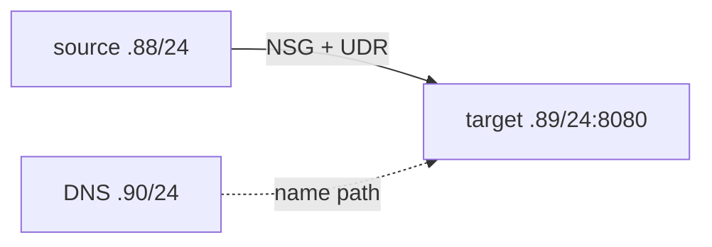

# Stage 08 — Fault diagnosis

**Outcome:** Inject, diagnose, correct, and roll back seven common network faults using reproducible evidence.
**Difficulty:** Advanced

## Objectives and prerequisites

Use the `10.20.88.0/21` independent topology. Live mode creates only source and target private VMs; target Python listens on 8080. Always prove listener health before interpreting network denial.



## Resources and cost

Default: RG, VNet, three subnets, NSG, and route table. Optional: two VMs/NICs/disks; no public IP/NVA. Private endpoint/DNS and peering faults use Stage 06/04 roots rather than adding paid resources here. Verify VM/disk and any optional service costs; unknown blocks live injection.

## Baseline

```powershell
./scripts/powershell/Invoke-TerraformStage.ps1 -Stage 08 -Action plan
# Approved live baseline: fault=none, enable_live=true, then prove TCP 8080.
```

```bash
./scripts/bash/terraform-stage.sh 08 plan
./scripts/bash/test-connectivity.sh <target-ip> 8080 allow
```

## Fault cards

| Fault / injection | Symptom and investigation | Expected evidence / root cause | Correct, verify, rollback |
|---|---|---|---|
| Incorrect NSG priority: `fault=nsg-priority` | 8080 times out; prove target listener, inspect effective NSG/IP flow | lower-number deny precedes allow; IP flow Deny | restore `fault=none`; new connection succeeds |
| Missing return route: `fault=return-route` | asymmetric timeout; inspect both NIC route tables | target-to-source return route is `None`; a real NVA also requires a valid reverse route | restore VnetLocal; verify both directions |
| Overlap: change a Stage 04 peer prefix to the other `/24` in a disposable edit | plan/check or Azure rejects peering | overlapping address spaces | revert exact `.80/24` and `.81/24`; plan passes |
| Wrong Private DNS link: link Stage 06 zone to an unrelated VNet in a disposable edit | public/no answer instead of PE IP | expected VNet lacks zone link | restore linked VNet ID; `getent` returns PE private IP |
| Missing peering option: set Stage 04 `allow_virtual_network_access=false` | peering/effective route or packet fails | directional access is disabled; forwarded-traffic flags still do not create transit | restore `true`; status Connected |
| Incorrect UDR next hop: `fault=udr-next-hop` | listener healthy but connection timeout | effective next hop `None` | restore VnetLocal; fresh connection succeeds |
| Public PaaS disabled too early: set Stage 06 public flag false without verification | Terraform plan fails safely | private endpoint + DNS/connectivity acknowledgement absent | keep public true, prove private path, set acknowledgement, re-plan |

For every card capture: injected variable/diff, timestamp, local listener, source/destination, fresh connection, effective NSG, effective route, service/peering state, diagnosis, corrected evidence, and clean rollback. Never leave a deliberate fault applied.

## Knowledge check

Why can effective NSG Allow coexist with a timeout? What proves DNS is using Private Link? Why is a route to an NVA insufficient? Which fault should Terraform reject before Azure?

## Cleanup and completion

Set `fault=none`, verify baseline, destroy Stage 08 and any disposable Stage 04/06 fault stage, then run the residual union. Complete only when all seven cards have root-cause evidence and no chargeable lab resource remains.
