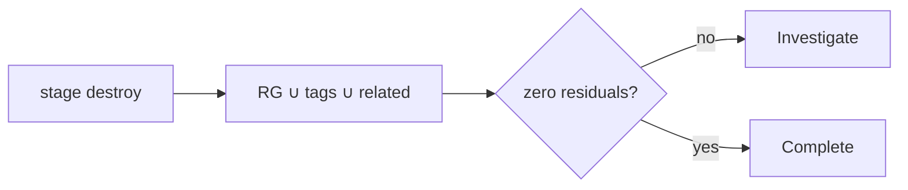

# Stage 09 — Cleanup and cost verification

**Outcome:** Prove that no chargeable lab resource remains anywhere in the subscription scope.
**Difficulty:** Intermediate

## Objectives and prerequisites

Destroy from Terraform state first, then inventory a union of known resource groups, mandatory tags, names, generated dependencies, and Network Watcher artifacts. Cost reporting can lag.



## Destroy

```powershell
foreach ($stage in '01','02','03','04','05','06','07','08') {
  ./scripts/powershell/Invoke-TerraformStage.ps1 -Stage $stage -Action destroy
}
./scripts/powershell/Test-ResidualResources.ps1
```

```bash
for stage in 01 02 03 04 05 06 07 08; do ./scripts/bash/terraform-stage.sh "$stage" destroy; done
./scripts/bash/test-residual-resources.sh
```

If state is missing, do **not** delete it to hide live resources. Inventory first. The PowerShell union includes:

1. all resources in `vnetlab-01-rg` through `vnetlab-08-rg`, plus `vnetlab-01-bicep-rg` and `vnetlab-01-cli-rg`;
2. resources with all mandatory tags (`environment=lab`, `owner`, `expires-on`, `managed-by=terraform`, `lab-stage`);
3. known `vnetlab-*` resources and matching artifacts in `NetworkWatcherRG`;
4. VNet flow logs/Storage, private endpoint NICs, managed disks, NICs, public IPs, snapshots, diagnostic settings, and monitoring workspaces.

Generated private endpoint NICs are joined by their private endpoint ID. Never delete shared `NetworkWatcherRG` wholesale.

After review, the emergency helper can delete only known lab groups:

```powershell
./scripts/powershell/Remove-LabResources.ps1 -Confirmation DELETE-VNET-LAB -WhatIf
# Remove -WhatIf only after reviewing exact targets.
```

Re-run inventory until zero. Then review Cost Management later because charges and budget data lag. Stopped/deallocated/detached resources can retain billed disks, IPs, snapshots, endpoints, storage, logs, and analytics.

## Knowledge check and completion

Why is deleting local state not cleanup? Why query outside known groups? Completion is binary only when the union count is zero and no chargeable line item remains attributable after reporting catches up.
