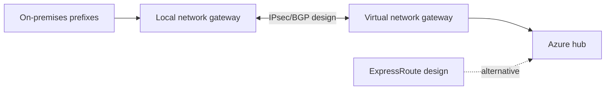

# Stage 10 — Hybrid networking design

**Outcome:** Produce a reviewed hybrid design without deploying a gateway or other fixed-cost connectivity.
**Difficulty:** Advanced / design-only

## Objectives and prerequisites

Compare point-to-site (individual clients), site-to-site (network appliances), local network gateways (on-premises prefixes/device), Virtual Network Gateway SKUs, active-active choices, BGP route exchange, ExpressRoute private connectivity, and forced tunneling.

## Design checklist and costs

- Confirm non-overlapping on-premises, Azure, partner, and growth CIDRs.
- Select P2S/S2S/ExpressRoute from requirements, not analogy.
- Document gateway subnet sizing, zone support, SKU throughput/SLA, active-active addresses, BGP ASN/peers, advertised/learned limits, failover, DNS, and asymmetric routing.
- Forced tunneling needs an explicit trusted egress next hop and correct management paths.
- Define least-privilege operations, diagnostics, key/certificate lifecycle, and emergency access.
- Discover current [VPN Gateway](https://azure.microsoft.com/pricing/details/vpn-gateway/) and [ExpressRoute](https://azure.microsoft.com/pricing/details/expressroute/) prices, circuits/provider fees, public IP, egress, and logs.

These resources are excluded because gateways/circuits have persistent charges, provisioning dependencies, external device/provider requirements, and cleanup risk. There are no Terraform commands or Azure resources in this stage.

PowerShell and Bash may use read-only pricing/document queries from Stage 00; neither should deploy. Positive evidence is an architecture review showing route propagation and failover. Negative review tests include an overlapping on-prem prefix, missing return advertisement, unsupported ASN, and forced-tunnel management loss.

## Knowledge check and completion

When is BGP useful? Why is ExpressRoute not automatically encrypted end-to-end? How does a gateway differ from peering transit? Complete when the diagram, route tables, failure modes, costs, prerequisites, and explicit **not deployed** statement are reviewed, with Stage 09 still reporting zero.
